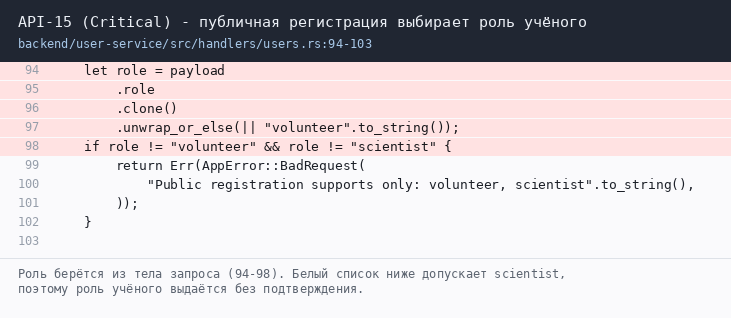

# Баг-репорты - Critical

Дефекты уровня Critical, заведены 04.06.2026. Индекс и метаданные - в [README.md](README.md).

Поле **Фактически** - поведение, выведенное из кода, а не наблюдённое на стенде: стенд не разворачивался (см. [README.md](README.md)).

### API-01. Открытый прокси для файлов (SSRF)

**Severity:** Critical | **Priority:** High | **Область:** `frontend/app/api/file-proxy/route.ts` - эндпоинт во frontend, автоматизированного
сценария нет

**Дефект:** `/api/file-proxy?url=...` выполняет запрос от имени сервера. Проверяется только протокол, хост не сверяется
с белым списком; в поставляемом коде осталась dev-подстановка `minio` -> `127.0.0.1`.

**Доказательство** - фрагмент кода с подсветкой строк дефекта:

**Код:** `frontend/app/api/file-proxy/route.ts:28-45` - валидация протокола без проверки хоста; `frontend/app/api/file-proxy/route.ts:11-18` - rewrite.

**Шаги.** Без токена: `GET :3000/api/file-proxy?url=http://minio:9000/`, затем `url=http://127.0.0.1:5432/` и
`url=http://169.254.169.254/latest/meta-data/`.

**Ожидается:** Отказ либо приём только адресов из явного белого списка.

**Фактически:** Запросы выполняются, клиент получает ответ внутреннего сервиса с его кодом и `Content-Type`.

**Влияние:** Анонимное чтение MinIO и БД, сканирование внутренней сети, использование сервера как точки выхода; в
облаке - кража временных учётных данных через метаданные. Связка с [API-02](#api-02-анонимный-доступ-к-персональным-данным-и-файлам) и [API-13](major-api.md#api-13-тип-загружаемого-файла-определяется-по-заголовку-клиента) даёт анонимное получение произвольного файла из хранилища.

**Фикс:** Белый список хостов, отклонение приватных диапазонов (`ipaddr.js`), только `https` в проде, вынос rewrite
под dev-флаг, лимит ответа и таймаут, требование авторизации.

### API-02. Анонимный доступ к персональным данным и файлам

**Severity:** Critical | **Priority:** High | **Область:** gateway `src/main.rs` | **Кейсы:** TC-API-08

**Дефект:** Публичность маршрутов определяется по префиксу пути, поэтому вложенные ресурсы наследуют публичность
вместе с публичным каталогом.

**Доказательство** - фрагмент кода с подсветкой строк дефекта:

**Шаги.** Взять UUID проекта, задания и наблюдения из публичного каталога, затем без заголовка `Authorization` вызвать
`GET .../observations`, `.../observations/{o}/comments`, `.../observations/{o}/files`, `/api/participations/{p}`.

**Ожидается:** Публичны только карточка проекта, список заданий и список наблюдений без содержимого комментариев и
данных участников.

**Фактически:** Все четыре запроса возвращают `200`.

**Влияние:** Любой посетитель с UUID (а он возвращается публичным каталогом) читает переписку и получает ссылки на
фотографии. Снимки волонтёров могут содержать географические привязки и частные территории - данные, на публикацию
которых согласия не давали. Публично раскрываются ФИО и роли участников.

**Фикс:** Перечислять публичные маршруты по полному совпадению пути; комментарии, файлы и состав участников - только
владельцу, участникам, учёному и админу; ссылки на файлы выдавать подписанными после проверки прав; добавить в чек-
лист проверку "каждый `GET` без токена".

### API-15. Публичная регистрация позволяет выбрать роль учёного

**Severity:** Critical | **Priority:** High | **Область:** user-service -> project-service, observation-service |
**Кейсы:** TC-API-15

**Дефект:** Роль приходит в теле запроса регистрации и сохраняется как есть, хотя должна назначаться сервером.

**Доказательство** - фрагмент кода с подсветкой строк дефекта:

**Шаги.** Без токена: `POST /api/users` с `{"email":"attacker@example.com"
"password":"Passw0rd","first_name":"Атакующий","role":"scientist"}`. Войти под этой учётной записью и выполнить `POST
/api/projects`.

**Ожидается:** `role = volunteer`, либо `400` при чужом значении `role`.

**Фактически:** `201 Created`, в базе `role = 'scientist'`, токен содержит `"role":"scientist"` - создание проекта
проходит проверку прав, хотя подтверждения учёного учётная запись не проходила.

**Влияние:** Повышение привилегий без проверки: в каталоге появляются проекты, автора которых система считает учёным.

**Фикс:** Роль назначает сервер и игнорирует поле из тела; допустимые роли держать перечислением; подтверждение
учёного - отдельным состоянием, а не ролью в профиле.
